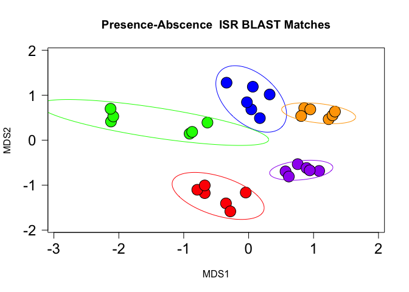
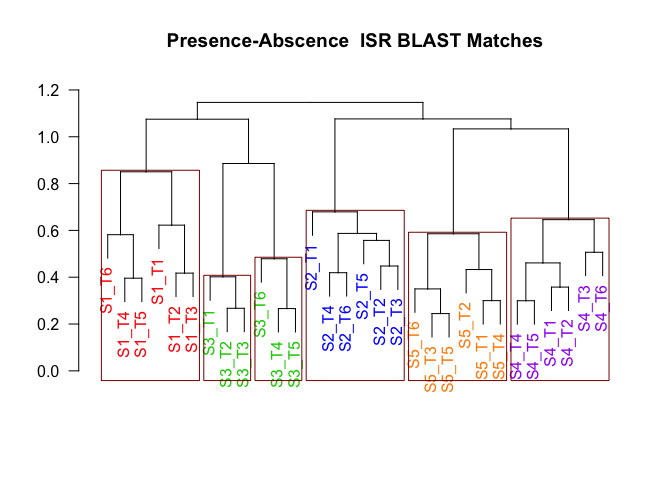

## About me 

 My background is in biotechnology engineering, and I have a MS in Microbiology & PhD in Biomedical Science. I have been involved in Bioinformatics Research for the past 6 years, mostly focussing on Human Microbiome sequencing data analysis.

  

# Genomics Data Science Projects

 

## Project 1: Analysis Related to Mukherjee Microbiome 2018 Publication
See relevant publication [here.](https://www.ncbi.nlm.nih.gov/pmc/articles/PMC6126016/)

### Platform: R

### Statistical & Visualization Techniques Utilized:
- Hierarchical Clustering
- Linear Regression
- Multidimensional Ordination

### [Analysis Highlight: Microbiome Potential in Forensics!](https://github.com/cm0109/ISR_manuscript/tree/master/ISR-MS-Demo_files/figure-markdown_github)

In this clinical microbiome study, microbial communities from dental plaque of five adult subjects was tracked over a 1-year period. Both the bacterial 16S V1-V3 region and 16-23 Intergenic Spacer Region (ISR) were sequenced for each sample, for species & strain-level community profiling, respectively.

  

Novel high-resolution ISR sequencing technique combined with DADA2-based processing allowed resolution of individual species into multiple subspecies variants, and revealed highly personalized bacterial profiles for individual subjects.

In the Figure above, each subject is denoted by a different color, and each point in the Non-metric Multidimensional Analysis (nMDS) ordination denotes a single time point (~2 months apart) over the 1 year period of sampling. Ellipses represent the 95% confidence interval for each subject.

 

The above figure shows Hierarchical Clustering Dendograms for Oral Microbiome Samples collected from 5 subjects (different colors) over 6 time points through the year.

These results Each subject had their own *Personalized* Oral Microbiota that remained stable (i.e. distinct from other subjects) over the 1 year study period.
This robust & individualized microbiota definitely raises the possibility of using high-resolution human microbiome data for tracking individuals, for example in forensic studies. 

For details of the code used to generate this data, please see the GitHub-friendly version of the RMarkdown available [here.](https://github.com/cm0109/ISR_manuscript/blob/master/ISR-MS-Demo.md)

