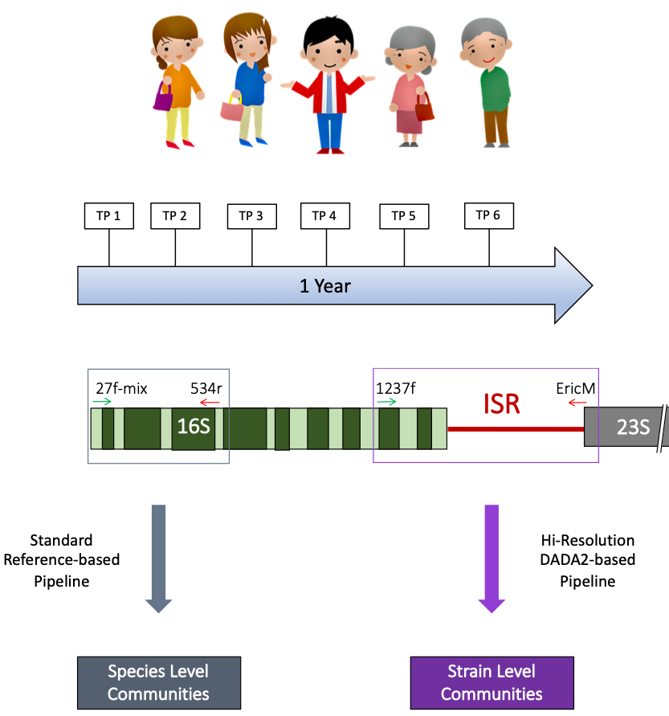

## About me 

 My background is in biotechnology engineering, and I have a MS in Microbiology & PhD in Biomedical Science. I have been involved in Bioinformatics Research for the past 6 years, mostly focussing on Human Microbiome sequencing data analysis.

  

# Genomics Data Science Projects

 

## Project 1: Analysis Related to Mukherjee Microbiome 2018 Publication
See relevant publication [here.](https://www.ncbi.nlm.nih.gov/pmc/articles/PMC6126016/)

### Platform: R

### Statistical & Visualization Techniques Utilized:
- Hierarchical Clustering
- Linear Regression
- Multidimensional Ordination

### Analysis Highlight: Microbiome Potential in Forensics!

In this clinical microbiome study, microbial communities from dental plaque of five adult subjects was tracked over a 1-year period. Both the bacterial 16S V1-V3 region and 16-23 Intergenic Spacer Region (ISR) were sequenced for each sample, for species & strain-level community profiling, respectively.

Novel high-resolution ISR sequencing technique combined with DADA2-based processing allowed resolution of individual species into multiple subspecies variants, and revealed highly personalized bacterial profiles for individual subjects.

